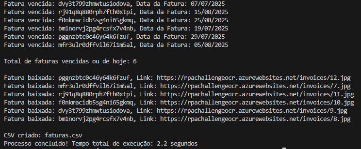

# doc9-teste-tecnico
Teste Técnico Doc9: Automação em Python para extrair dados de uma tabela web, fazer o download de PDFs e gerar um CSV.

## Descrição
Esse script baixa automaticamente todas as faturas de um site, filtra apenas as faturas vencidas ou que vencem hoje e gera um CSV com informações de cada fatura.

## Estrutura do projeto
- `main.py`: Código principal que faz o download e cria o CSV.
- `downloader.py`: Funções para download de faturas.
- `csv_utils.py`: Função que cria o CSV.
- `data_utils.py`: Função que filtra as faturas vencidas.
- `file_utils.py`: Função que apaga o CSV e limpa a pasta `invoices/` de execuções anteriores.
- `config.py`: Arquivo que contém parâmetros de configuração.
- `invoices/`: Pasta onde as faturas serão salvas.


## Requisitos
- Python 3.1x
- Nenhuma biblioteca externa é necessária; todas as usadas são padrão do Python (`os`, `csv`, `datetime`, `concurrent.futures`, `requests`).

## Configuração e Execução
1. **Clonar o repositório**
   ```bash 
   git clone https://github.com/romulosousi/doc9-teste-tecnico.git 
   cd doc9-teste-tecnico
3. **Executar o script principal**
   ```bash
    `python main.py`
5. **Resultado esperado** 
    - Um arquivo chamado faturas.csv será gerado na raiz do projeto, contendo as colunas: 
        - ID da Fatura
        - Data da Fatura
        - URL da Fatura
    - Apenas as faturas vencidas ou que vencem hoje estarão incluídas.
    - Todas as faturas baixadas estarão na pasta `invoices/`.

## Decisões Técnicas e Otimizações de Performance
- **Escolha da biblioteca:** A ideia inicial era usar Selenium, mas como um dos critérios de avaliação era executar o código em menos de 2 segundos, o Selenium teria desclassificado o projeto. Por isso utilizei a biblioteca nativa `requests` para capturar via POST o JSON contendo todas as faturas.

- **Download paralelo:** Todas as faturas precisam ser baixadas. Como são até 12 faturas, baixar uma a uma levaria cerca de 12 segundos. Para otimizar, foi usado `ThreadPoolExecutor` com `max_workers=12`, permitindo baixar todas em paralelo, reduzindo o tempo total para cerca de 1 segundo.

- **Bibliotecas padrão do Python:** Nenhuma biblioteca externa é necessária; todas usadas são padrão do Python (`os`, `csv`, `datetime`, `concurrent.futures`, `requests`).

- **Observação sobre tempo de execução:** No computador local (Aracaju - Sergipe), o tempo médio foi de 2 segundos. No Google Colab, devido à proximidade do servidor e outras variáveis, o tempo caiu para cerca de 1,2 segundos.

### Execução Local


### Execução no Google Colab

